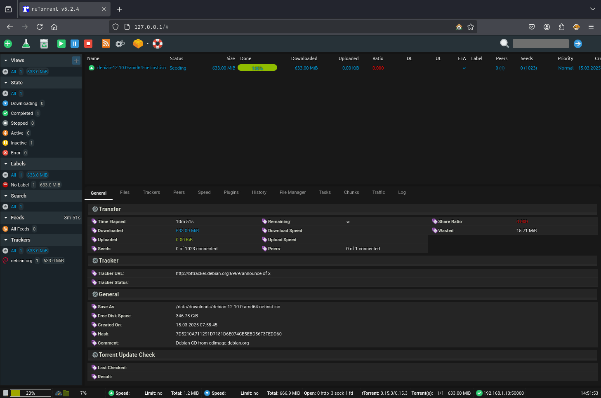

<p align="center"><a href="https://gitlab.com/cyberpnkz/rutorrent" target="_blank"></a></p>

<p align="center">
  <a href="https://hub.docker.com/r/k44sh/rutorrent/tags?page=1&ordering=last_updated">
    
  </a>
  <a href="https://hub.docker.com/r/k44sh/rutorrent/">
    
  </a>
  <a href="https://hub.docker.com/r/k44sh/rutorrent/">
    
  </a>
  <a href="https://gitlab.com/cyberpnkz/rutorrent/-/pipelines/main/latest">
    
  </a>
  <a href="https://gitlab.com/cyberpnkz/rutorrent/-/pipelines/dev/latest">
    
  </a>
</p>
<p align="center">
  <a href="https://github.com/k44sh/rutorrent">
    
  </a>
  <a href="https://github.com/k44sh/rutorrent/network/members">
    
  </a>
  <a href="https://github.com/k44sh/rutorrent/blob/main/LICENSE">
    
  </a>
</p>

## About

[rTorrent](https://github.com/rakshasa/rtorrent) and [ruTorrent](https://github.com/Novik/ruTorrent) Docker image based on [Alpine Linux](https://alpinelinux.org/).<br />
___

## Features

* Run as non-root user
* Multi-platform image
* [NGINX](https://nginx.org/download) with [PHP 8.4](https://www.php.net/releases/8.4/en.php)
* [GeoIP2](https://www.maxmind.com/en/geoip-databases) database by [MaxMind](https://www.maxmind.com) (_Update with your own key_)
* [geoipupdate](https://github.com/maxmind/geoipupdate) to update MaxMind's GeoIP2 databases
* [Cloudflare](https://www.cloudflare.com/ips/) trusted addresses for NGINX Real IP (_not enable by default_)
* [libTorrent](https://github.com/rakshasa/libtorrent) (`0.15.3`) / [rTorrent](https://github.com/rakshasa/rtorrent) (`0.15.3`) compiled from source
* [ruTorrent](https://github.com/Novik/ruTorrent) release (`v5.2.4`)
* [c-ares](https://github.com/rakshasa/rtorrent/wiki/Performance-Tuning#rtrorrent-with-c-ares) and [UDNS](https://www.corpit.ru/mjt/udns.html) for asynchronous DNS requests
* [mktorrent](https://github.com/Rudde/mktorrent) installed for ruTorrent create plugin
* [Radarr](https://radarr.video) / [Sonarr](https://sonarr.tv) hardlinks compliance
* ruTorrent [GeoIP2](https://github.com/Micdu70/geoip2-rutorrent) plugin
* ruTorrent [Filemanager](https://github.com/nelu/rutorrent-filemanager) plugin
* ruTorrent [Ratiocolors](https://github.com/Gyran/rutorrent-ratiocolor) plugin
* ruTorrent [QuickBox](https://github.com/TrimmingFool/club-QuickBox) theme
* `WAN IP` address automatically resolved for reporting to the tracker
* `XMLRPC` through nginx over SCGI socket (basic auth optional)
* `WebDAV` on completed downloads (basic auth optional)
* Ability to add a custom ruTorrent `plugin` / `theme`
* Allow specific configuration for `data` folder
* Allow specific configuration for `config` folder

## Volume Overview

| **Volume** | **Description**                                      |
| ---------- | ---------------------------------------------------- |
| `/config`  | Stores rTorrent, ruTorrent, and other configurations |
| `/data`    | Main storage for downloaded torrent files            |
| `/passwd`  | Holds `.htpasswd` files for HTTP authentication      |

> :information_source: **Note:** Volumes should be owned by the user/group matching the specified `PUID` and `PGID`.  

## Radarr / Sonarr Users

It is recommended to use the same `data` volume for `ruTorrent` and `Radarr`/`Sonarr`, in order to have a structure similar to this :

```shell
data
├── downloads
└── media
   ├── movies
   ├── music
   └── tv
```

:information_source: More informations here : [TRaSH Guide](https://trash-guides.info/Hardlinks/How-to-setup-for/Docker/)

## Multi Platform Images

* linux/amd64
* linux/arm64
* linux/arm/v7

## Usage

### Docker Compose

Docker compose is the recommended way to run this image. Edit the compose file with your preferences and run the following command:

```shell
mkdir $(pwd)/{config,data,passwd}
chown ${PUID}:${PGID} $(pwd)/{config,data,passwd}
docker compose up -d
docker compose logs -f
```

### Upgrade

To upgrade, pull the newer image and launch the container:

```shell
docker compose pull
docker compose up -d
```

### Cleanup

```shell
docker compose down -v
rm -rf $(pwd)/{config,data,passwd}
```

### Command line

You can also use the following minimal command:

```shell
mkdir $(pwd)/{config,data,passwd}
chown ${PUID}:${PGID} $(pwd)/{config,data,passwd}
docker run -d --name rutorrent \
  --ulimit nproc=65535 \
  --ulimit nofile=32000:40000 \
  -p 6881:6881/udp \
  -p 8000:8000 \
  -p 8080:8080 \
  -p 9000:9000 \
  -p 50000:50000 \
  -v $(pwd)/config:/config \
  -v $(pwd)/data:/data \
  -v $(pwd)/passwd:/passwd \
  k44sh/rutorrent:latest && \
  docker logs -f rutorrent
```

## Environment variables

### General

| **Variable**                 | **Description**                                           | **Default**                         |
| ---------------------------- | --------------------------------------------------------- | ----------------------------------- |
| `TZ`                         | The timezone assigned to the container                    | `UTC`                               |
| `PUID`                       | rTorrent user ID                                          | `1000`                              |
| `PGID`                       | rTorrent group ID                                         | `1000`                              |
| `CONFIG_PATH`                | ruTorrent configuration path                              | `/config`                           |
| `TOPDIR_PATH`                | ruTorrent top directory                                   | `/data`                             |
| `DOWNLOAD_PATH`              | Path for downloaded files                                 | `/data/downloads`                   |
| `MM_ACCOUNT`                 | Your MaxMind account ID                                   | _(required for auto update)_        |
| `MM_LICENSE`                 | Your MaxMind license key                                  | _(required auto update)_            |
| `WAN_IP`                     | Public IP address reported to the tracker                 | Auto resolved                       |
| `MEMORY_LIMIT`               | PHP memory limit                                          | `512M`                              |
| `UPLOAD_MAX_SIZE`            | Max upload size                                           | `16M`                               |
| `CLEAR_ENV`                  | Clear environment in PHP-FPM workers                      | `yes`                               |
| `OPCACHE_MEM_SIZE`           | PHP OpCache memory size                                   | `256`                               |
| `MAX_FILE_UPLOADS`           | Max number of files allowed to be uploaded simultaneously | `50`                                |
| `AUTH_DELAY`                 | Delay before HTTP Basic Auth is enforced                  | `0s`                                |
| `REAL_IP_FROM`               | Trusted CIDR ranges that can set real client IPs          | `false`                             |
| `REAL_IP_CF`                 | Trusted Cloudflare IP ranges that can set real client IPs | `false`                             |
| `REAL_IP_HEADER`             | Header containing the real client IP                      | `X-Forwarded-For`                   |
| `LOG_IP_VAR`                 | Variable used in Nginx logs for remote IP                 | `remote_addr`                       |
| `XMLRPC_AUTHBASIC_STRING`    | Message shown for XMLRPC Basic Auth                       | `rTorrent XMLRPC restricted access` |
| `XMLRPC_PORT`                | XMLRPC port through Nginx (over SCGI socket)              | `8000`                              |
| `XMLRPC_SIZE_LIMIT`          | Max body size of XMLRPC calls                             | `2M`                                |
| `RUTORRENT_AUTHBASIC_STRING` | Message shown for ruTorrent Basic Auth                    | `ruTorrent restricted access`       |
| `RUTORRENT_PORT`             | HTTP port used by ruTorrent                               | `8080`                              |
| `WEBDAV_AUTHBASIC_STRING`    | Message shown for WebDAV Basic Auth                       | `WebDAV restricted access`          |
| `WEBDAV_PORT`                | WebDAV port for accessing completed downloads             | `9000`                              |

### rTorrent

| **Variable**              | **Description**                                             | **Default** |
| ------------------------- | ----------------------------------------------------------- | ----------- |
| `RT_LOG_LEVEL`            | rTorrent log level                                          | `info`      |
| `RT_LOG_EXECUTE`          | Log executed commands to `/config/rtorrent/log/execute.log` | `false`     |
| `RT_LOG_XMLRPC`           | Log XMLRPC queries to `/config/rtorrent/log/xmlrpc.log`     | `false`     |
| `RT_SESSION_SAVE_SECONDS` | Interval (in seconds) between saving session data to disk   | `3600`      |
| `RT_TRACKER_DELAY_SCRAPE` | Delay tracker announces at startup                          | `true`      |
| `RT_RECEIVE_BUFFER_SIZE`  | TCP receive buffer size (`network.receive_buffer.size.set`) | `16M`       |
| `RT_SEND_BUFFER_SIZE`     | TCP send buffer size (`network.send_buffer.size.set`)       | `16M`       |
| `RT_PREALLOCATE_TYPE`     | Disk space preallocation type                               | `0`         |
| `RT_DHT_PORT`             | DHT UDP port (`dht.port.set`)                               | `6881`      |
| `RT_INC_PORT`             | Incoming port range (`network.port_range.set`)              | `50000`     |

### ruTorrent

| **Variable**                     | **Description**                                                   | **Default**                       |
| -------------------------------- | ----------------------------------------------------------------- | --------------------------------- |
| `RU_REMOVE_CORE_PLUGINS`         | Remove ruTorrent core plugins; comma-separated                    | `false`                           |
| `RU_HTTP_USER_AGENT`             | ruTorrent HTTP user agent                                         | `Mozilla Firefox`                 |
| `RU_HTTP_TIME_OUT`               | ruTorrent HTTP timeout in seconds                                 | `30`                              |
| `RU_HTTP_USE_GZIP`               | Use HTTP Gzip compression                                         | `true`                            |
| `RU_RPC_TIME_OUT`                | ruTorrent RPC timeout in seconds                                  | `5`                               |
| `RU_LOG_RPC_CALLS`               | Log ruTorrent RPC calls                                           | `false`                           |
| `RU_LOG_RPC_FAULTS`              | Log ruTorrent RPC faults                                          | `true`                            |
| `RU_PHP_USE_GZIP`                | Use PHP Gzip compression                                          | `false`                           |
| `RU_PHP_GZIP_LEVEL`              | PHP Gzip compression level                                        | `2`                               |
| `RU_SCHEDULE_RAND`               | Random delay (0 to X seconds) for scheduler start                 | `10`                              |
| `RU_LOG_FILE`                    | ruTorrent log file path for error messages                        | `/config/rutorrent/rutorrent.log` |
| `RU_DO_DIAGNOSTIC`               | ruTorrent diagnostics (e.g., permission checks)                   | `true`                            |
| `RU_CACHED_PLUGIN_LOADING`       | Enable rapid cached loading of ruTorrent plugins                  | `false`                           |
| `RU_SAVE_UPLOADED_TORRENTS`      | Save uploaded torrent files to `/config/rutorrent/share/torrents` | `true`                            |
| `RU_OVERWRITE_UPLOADED_TORRENTS` | Overwrite existing `.torrent` files                               | `false`                           |
| `RU_FORBID_USER_SETTINGS`        | Enforce global settings, even with HTTP auth                      | `false`                           |
| `RU_LOCALE`                      | Default locale for ruTorrent                                      | `UTF8`                            |

## Ports

| **Port** | **Variable**     | **Description**                                 |
| -------- | ---------------- | ----------------------------------------------- |
| `6881`   | `RT_DHT_PORT`    | DHT UDP port (`dht.port.set`)                   |
| `50000`  | `RT_INC_PORT`    | Incoming connections (`network.port_range.set`) |
| `8000`   | `XMLRPC_PORT`    | XMLRPC port through Nginx over SCGI socket      |
| `8080`   | `RUTORRENT_PORT` | ruTorrent HTTP port                             |
| `9000`   | `WEBDAV_PORT`    | WebDAV port for completed downloads             |

## Notes

### WebDAV

WebDAV allows you to retrieve your completed torrent files in `/data` on port `9000`. Like XMLRPC, these
requests can be secured with basic authentication through the `/passwd/webdav.htpasswd` file in which you will need to
add a username with his password. See below to populate this file with a user / password.

### Populate .htpasswd files

For ruTorrent basic auth, XMLRPC through nginx and WebDAV on completed downloads, you can populate `.htpasswd`
files with the following command:

```bash
docker run --rm -it httpd:2.4-alpine htpasswd -Bbn <username> <password> >> $(pwd)/passwd/webdav.htpasswd
```

Htpasswd files used:

* `rpc.htpasswd`: XMLRPC through nginx
* `rutorrent.htpasswd`: ruTorrent basic auth
* `webdav.htpasswd`: WebDAV on completed downloads

### Override or add a ruTorrent plugin/theme

You can add a plugin for ruTorrent in `/config/rutorrent/plugins/`.

If you add a plugin that already exists in ruTorrent,
it will be removed from ruTorrent core plugins and yours will be used. And you can also add a theme in
`/config/rutorrent/themes/`. The same principle as for plugins will be used if you want to override one.

> :information_source: Container has to be restarted to propagate changes

### Edit a ruTorrent plugin configuration

As you probably know, plugin configuration is not outsourced in ruTorrent. Loading the configuration of a plugin is
done via a `conf.php` file placed at the root of the plugin folder. To solve this issue with Docker, a special folder
has been created in `/config/rutorrent/plugins-conf` to allow you to configure plugins. For example to configure the
`diskspace` plugin, you will need to create the `/config/rutorrent/plugins-conf/diskspace.php` file with your
configuration:

```php
<?php
$diskUpdateInterval = 10;	// in seconds
$notifySpaceLimit = 512;	// in Mb
$partitionDirectory = null;	// if null, then we will check rtorrent download directory 
```

> :information_source: Container has to be restarted to propagate changes

Fork based on the version of [CrazyMax](https://github.com/crazy-max/docker-rtorrent-rutorrent)
